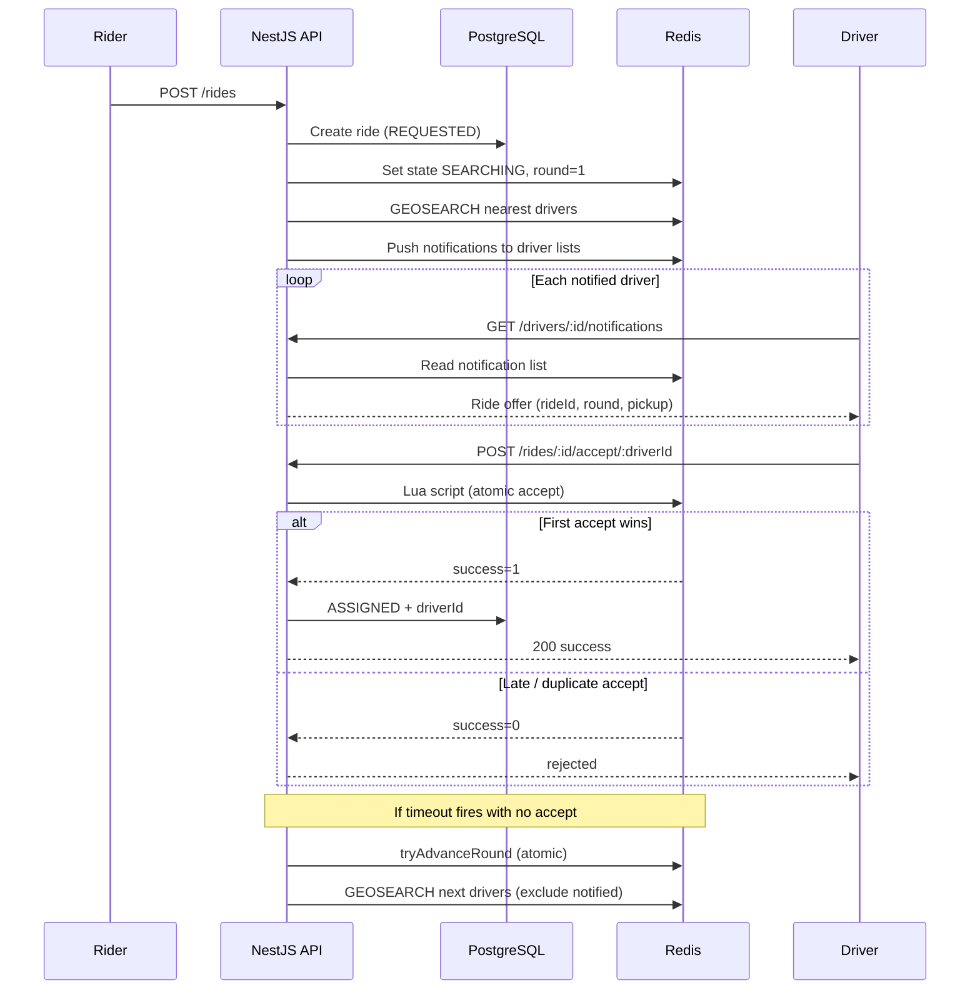

# Vybe Cabs — Real-Time Driver Allocation System

A backend service that simulates core ride-hailing allocation: geo-based driver discovery, concurrent ride offers, atomic first-accept-wins assignment, timeout/retry, and idempotent acceptance handling.

Built as a technical assignment for the vybe cabs backend engineering role.

---

## Project Overview

When a rider requests a ride, the system:

1. Finds the nearest available drivers using **Redis GEO**
2. Notifies multiple drivers simultaneously (via a **polling-based notification log**)
3. Assigns the ride to the **first driver who accepts**, using a **Redis Lua script** for atomicity
4. Retries with the next batch of drivers if nobody accepts within the timeout window
5. Marks the ride as `TIMEOUT` after exhausting all retry rounds

PostgreSQL stores durable ride and driver records. Redis handles geo indexing, ephemeral allocation state, and concurrency control.

---

## Features

| Feature | Implementation |
|---------|----------------|
| Geo-based driver search | Redis `GEOADD` + `GEOSEARCH` with dynamic location updates |
| Concurrent assignment safety | Lua script — single atomic compare-and-set |
| Timeout & retry | Configurable per-round timeout with next-driver-batch retry |
| Ride lifecycle | `REQUESTED` → `SEARCHING` → `ASSIGNED` / `TIMEOUT` |
| Idempotent acceptance | `Idempotency-Key` header + Redis token deduplication |
| Concurrency verification | `npm run test:concurrency` script + Jest e2e test |
| Driver notifications | Redis list + `GET /drivers/:id/notifications` polling |

---

## Technologies Used

- **NestJS** (TypeScript) — API framework
- **PostgreSQL** — persistent storage (rides, drivers)
- **Redis** — geo index, allocation state, Lua atomic ops
- **TypeORM** — ORM
- **Docker Compose** — local Postgres + Redis

---

## Folder Structure

```
vybe_cabs/
├── docker-compose.yml          # Postgres + Redis
├── .env.example                # Environment template
├── scripts/
│   └── concurrency-test.ts     # Runnable concurrency proof
├── src/
│   ├── common/enums/           # RideStatus, DriverStatus
│   ├── config/                 # App configuration
│   ├── drivers/                # Driver CRUD, location, notifications
│   ├── redis/
│   │   ├── lua/accept-ride.lua # Atomic acceptance script
│   │   └── redis.service.ts    # Geo search, state, Lua eval
│   └── rides/
│       ├── allocation.service.ts  # Core allocation logic
│       ├── rides.controller.ts
│       └── rides.service.ts
├── test/
│   ├── concurrency.e2e-spec.ts
│   └── app.e2e-spec.ts
├── WRITEUP.md                  # Design decisions (2-page write-up)
└── VIDEO_SCRIPT.md             # Demo recording script
```

---

## Architecture



---

## Installation

### Prerequisites

- Node.js 18+
- Docker Desktop (for Postgres and Redis)

### Steps

```bash
# 1. Clone and install
git clone https://github.com/dandusaikrishna/driver_allocation-Vybe_cabs.git
cd vybe_cabs
npm install

# 2. Environment
cp .env.example .env

# 3. Start infrastructure
docker compose up -d

# 4. Run the API
npm run start:dev
```

The API listens on `http://localhost:3000`.

---

## How to Run

| Command | Description |
|---------|-------------|
| `npm run docker:up` | Start Postgres + Redis |
| `npm run docker:down` | Stop containers |
| `npm run start:dev` | Dev server with hot reload |
| `npm run build` | Compile TypeScript |
| `npm run start:prod` | Run compiled build |
| `npm run test:concurrency` | **Concurrency verification script** |
| `npm run test:e2e` | Jest end-to-end tests (needs Docker) |

---

## Usage

### 1. Register drivers near a pickup point

```bash
curl -X POST http://localhost:3000/drivers \
  -H "Content-Type: application/json" \
  -d '{
    "name": "Raj",
    "phone": "+919876543210",
    "latitude": 12.9726,
    "longitude": 77.5956
  }'
```

Create 2–3 more drivers with slightly different coordinates.

### 2. Update driver location (optional)

```bash
curl -X PATCH http://localhost:3000/drivers/<DRIVER_ID>/location \
  -H "Content-Type: application/json" \
  -d '{"latitude": 12.9730, "longitude": 77.5960}'
```

### 3. Request a ride

```bash
curl -X POST http://localhost:3000/rides \
  -H "Content-Type: application/json" \
  -d '{
    "riderId": "rider-001",
    "pickupLatitude": 12.9716,
    "pickupLongitude": 77.5946
  }'
```

Save the returned `id` as `RIDE_ID`.

### 4. Drivers poll for notifications

```bash
curl http://localhost:3000/drivers/<DRIVER_ID>/notifications
```

Response includes `rideId`, `round`, and pickup coordinates.

### 5. Driver accepts the ride

```bash
curl -X POST http://localhost:3000/rides/<RIDE_ID>/accept/<DRIVER_ID> \
  -H "Content-Type: application/json" \
  -H "Idempotency-Key: unique-key-123" \
  -d '{"round": 1}'
```

### 6. Check ride status

```bash
curl http://localhost:3000/rides/<RIDE_ID>
```

### 7. Run concurrency test

With the server running:

```bash
npm run test:concurrency
```

Expected output: exactly **1 WIN**, **4 LOSE**, final status `ASSIGNED`.

---

## API Endpoints

| Method | Endpoint | Description |
|--------|----------|-------------|
| `POST` | `/drivers` | Register a driver |
| `GET` | `/drivers` | List all drivers |
| `GET` | `/drivers/:id` | Get driver by ID |
| `PATCH` | `/drivers/:id/location` | Update driver GPS position |
| `PATCH` | `/drivers/:id/status` | Set AVAILABLE / BUSY / OFFLINE |
| `GET` | `/drivers/:id/notifications` | Poll ride offers |
| `POST` | `/rides` | Request a new ride |
| `GET` | `/rides` | List rides |
| `GET` | `/rides/:id` | Get ride status |
| `POST` | `/rides/:rideId/accept/:driverId` | Driver accepts ride |

---

## Assumptions

- **Notification delivery**: Polling over a Redis-backed notification log (simple, auditable, no WebSocket infra needed for the assignment). Production would likely use push/SSE/WebSockets.
- **Single API instance**: Timeout scheduling uses in-process `setTimeout`. Multi-instance would need Redis keyspace notifications or a job queue (Bull/BullMQ).
- **Synchronize=true**: TypeORM auto-syncs schema for easy local setup. Production would use migrations.
- **No authentication**: Endpoints are open for demo purposes.
- **Driver availability**: Only `AVAILABLE` drivers are indexed in Redis GEO and eligible for offers.

---

## Concurrency Handling (Summary)

The critical path is `POST /rides/:rideId/accept/:driverId`. A **Lua script** runs atomically in Redis:

- Checks ride state is `SEARCHING`
- Validates the allocation **round** matches (rejects stale accepts after timeout)
- Sets assigned driver only if none exists yet
- Returns idempotent success if the same driver already won

This guarantees exactly one winner even when 50 drivers hit accept in the same millisecond.

See [WRITEUP.md](./WRITEUP.md) for the full design rationale.

---

## Future Improvements

- WebSocket/SSE push notifications instead of polling
- BullMQ for distributed timeout scheduling across instances
- Redis Cluster for horizontal Redis scaling
- OpenTelemetry tracing on allocation rounds
- Dead-letter queue for failed Postgres writes after Redis assignment
- Circuit breaker on Redis/Postgres failures
- Load testing with k6 (1000+ concurrent ride requests)

---

## Author

**Saikrishna**  
Backend Technical Assignment — vybe cabs  
Submitted: July 2026

---

## License

UNLICENSED — assignment submission.
